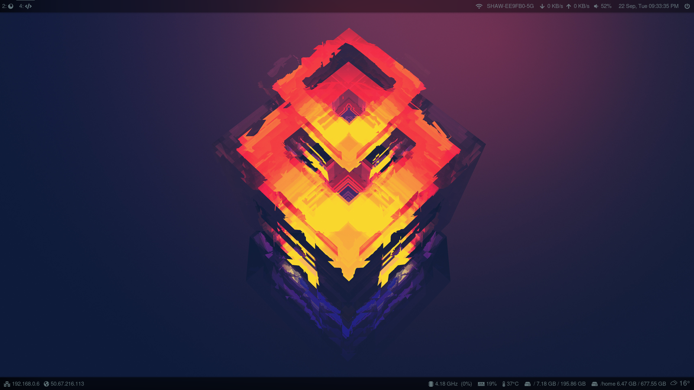
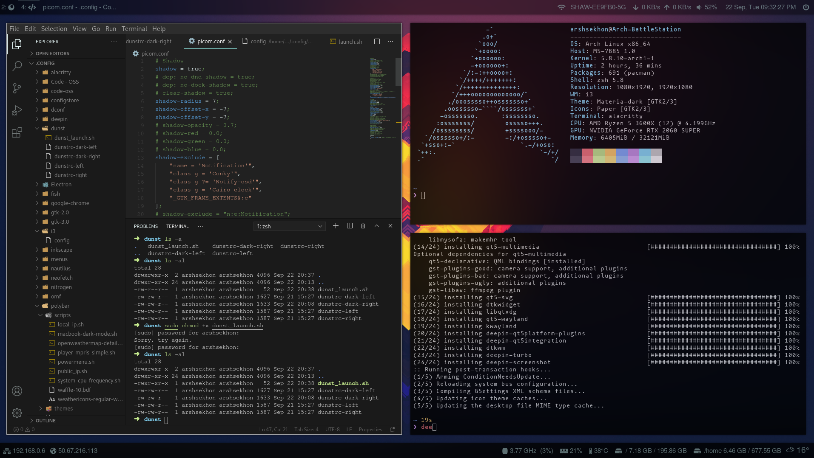
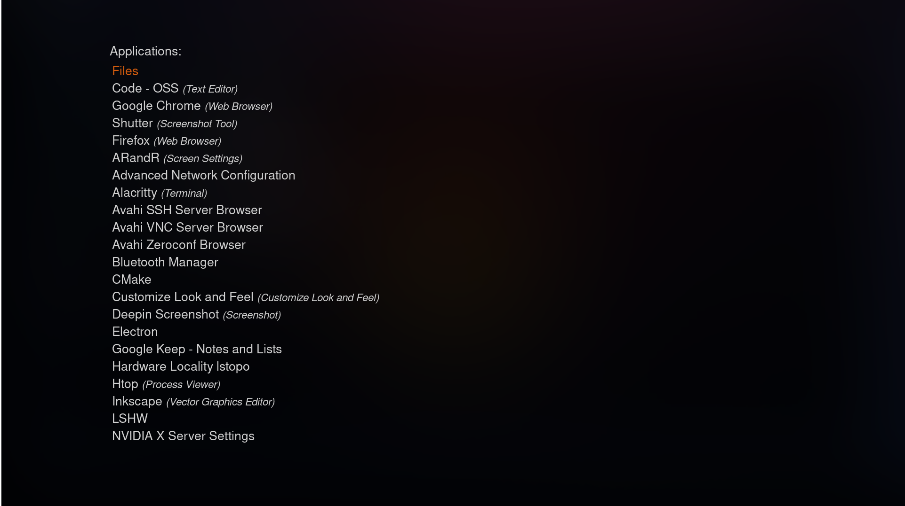
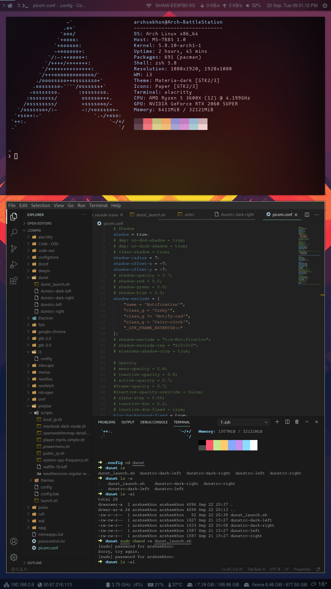
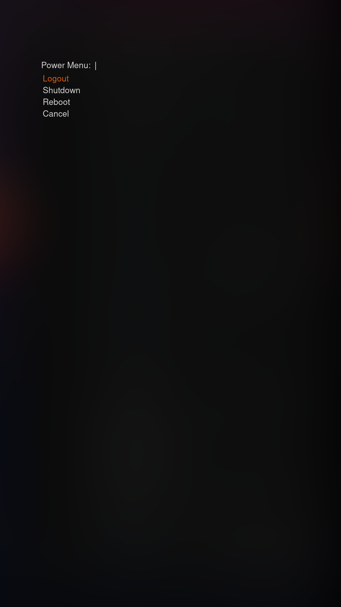

# Dotfiles: Ricing up Linux 🐧🌾🍙🍚

### What are dot files?
Dotfiles are the hidden customization files that are used to personalize your Linux distro and really make it your very own. You can save these dotfiles and configure a fresh install of linux to your liking. You can also share your dotfiles with other users so they can achieve similar results as you. This repository contains my personal dotfiles.

### Packages

- [i3-gaps-rounded](https://aur.archlinux.org/packages/i3-gaps-rounded-git/)
- [polybar](https://aur.archlinux.org/packages/polybar/)
- [picom-git](https://aur.archlinux.org/packages/picom-git/)
- [dunst](https://aur.archlinux.org/packages/dunst-git/)
- [rofi](https://www.archlinux.org/packages/community/x86_64/rofi/)
- [alacritty](https://www.archlinux.org/packages/community/x86_64/alacritty/)
- [zsh](https://www.archlinux.org/packages/extra/x86_64/zsh/)
- [ohmyzsh](https://github.com/ohmyzsh/ohmyzsh)

## Screenshots

| | |
|-|-|
|  |  |

## How to restore

1. Clone the repo.
2. Open a terminal inside the cloned repo folder and run `stow -vSt ~ *`
3. Have fun with your riced up Linux 🐧🌾🍙🍚.

**Note:** If there are any conflicts, delete the default configs inside your home dir and try again.
